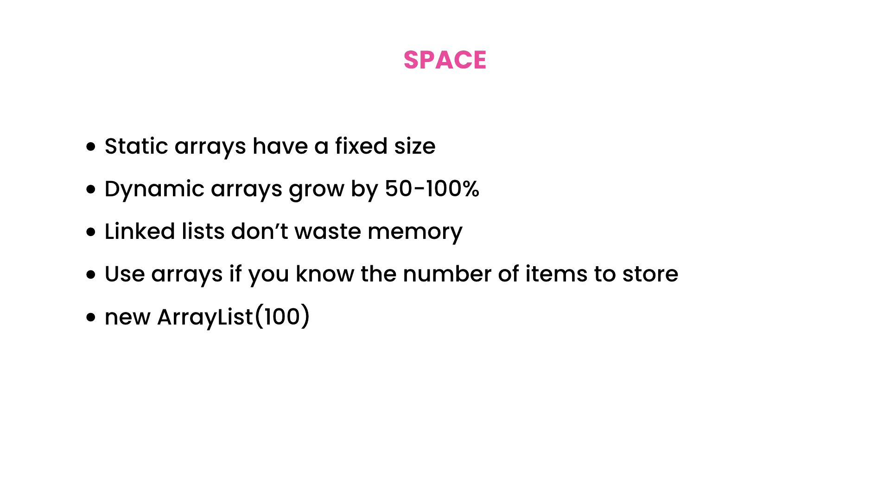
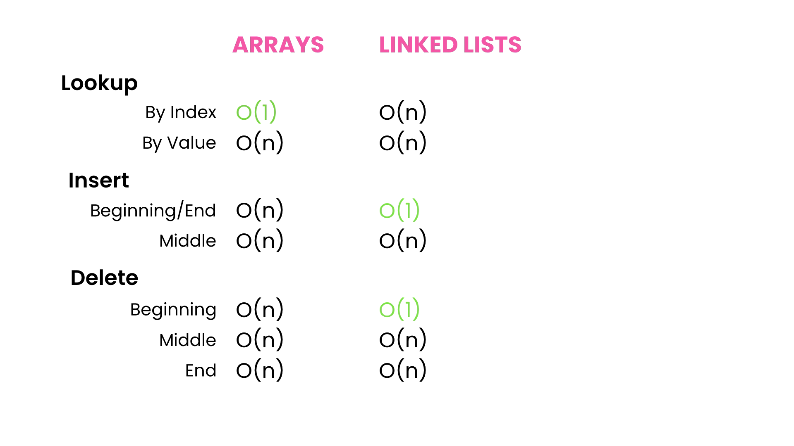

# Linked Lists

### **Linked List Overview**

A **linked list** is a data structure consisting of a sequence of elements (called nodes), where each node contains:

1. **Data**: The actual value or information the node holds.
2. **Next**: A reference (or pointer) to the next node in the sequence.

Unlike arrays, linked lists:

- Do not store elements in contiguous memory locations.
- Can dynamically grow or shrink in size.
- Are better suited for scenarios involving frequent insertions and deletions.

### **Types of Linked Lists**

1. **Singly Linked List**: Each node has one pointer, which points to the next node.
2. **Doubly Linked List**: Each node has two pointers, one pointing to the next node and the other to the previous node.
3. **Circular Linked List**: The last node points back to the first node, forming a loop.

---

### **Key Operations on Linked Lists**

1. **Insertion**:
    - At the beginning.
    - At the end.
    - At a specific position.
2. **Deletion**:
    - From the beginning.
    - From the end.
    - From a specific position.
3. **Traversal**: Visiting each node to access or process its data.
4. **Searching**: Finding a specific node based on its data.

---

### **Advantages of Linked Lists**

1. Dynamic size: Unlike arrays, no need to predefine the size.
2. Efficient insertions/deletions: Especially for large datasets.
3. No memory wastage: Allocates memory as needed.

### **Disadvantages of Linked Lists**

1. Slower access: O(n) time complexity for accessing elements, compared to O(1) for arrays.
2. Extra memory usage: Storing pointers consumes additional memory.

The time complexity of operations on a linked list depends on the specific operation and the type of linked list (
singly, doubly, or circular). Here's a breakdown:

---

### **1. Traversal**

- **Time Complexity**: \(O(n)\)
- **Reason**: To access a specific node, you must start at the head and follow the links sequentially until the desired
  node is reached. There is no direct indexing like arrays.

---

### **2. Insertion**

#### **At the Beginning**

- **Time Complexity**: \(O(1)\)
- **Reason**: No traversal is needed. You create a new node, update its `next` pointer to the current head, and set the
  head to this new node.

#### **At the End**

- **Time Complexity**:
    - \(O(n)\) for **singly linked list** (if no tail pointer is maintained).
    - \(O(1)\) for **doubly linked list or singly linked list with a tail pointer**.
- **Reason**:
    - In a singly linked list without a tail, you must traverse the entire list to find the last node.
    - If a tail pointer is maintained (or for doubly linked lists), the last node is readily accessible.

#### **At a Specific Position**

- **Time Complexity**: \(O(n)\)
- **Reason**: You must traverse the list to locate the desired position, which can take up to \(O(n)\) time. Inserting
  itself is \(O(1)\).

---

### **3. Deletion**

#### **From the Beginning**

- **Time Complexity**: \(O(1)\)
- **Reason**: The head is directly accessible. You simply update the head to the next node.

#### **From the End**

- **Time Complexity**:
    - \(O(n)\) for **singly linked list**.
    - \(O(1)\) for **doubly linked list**.
- **Reason**:
    - In a singly linked list, you must traverse the entire list to find the second last node.
    - In a doubly linked list, the previous node of the tail is directly accessible.

#### **At a Specific Position**

- **Time Complexity**: \(O(n)\)
- **Reason**: To delete a node at a specific position, you must traverse the list to find the node or its predecessor.

---

### **4. Searching**

- **Time Complexity**: \(O(n)\)
- **Reason**: You must traverse the list sequentially to find the node with the desired value. There is no random access
  capability.

---

### **Summary Table**

| **Operation**             | **Singly Linked List** | **Doubly Linked List** |
|---------------------------|------------------------|------------------------|
| Insertion at Beginning    | \(O(1)\)               | \(O(1)\)               |
| Insertion at End          | \(O(n)\) / \(O(1)^\*\) | \(O(1)\)               |
| Deletion at Beginning     | \(O(1)\)               | \(O(1)\)               |
| Deletion at End           | \(O(n)\)               | \(O(1)\)               |
| Insertion at Specific Pos | \(O(n)\)               | \(O(n)\)               |
| Deletion at Specific Pos  | \(O(n)\)               | \(O(n)\)               |
| Searching                 | \(O(n)\)               | \(O(n)\)               |

- \(O(1)\) insertion at the end for singly linked lists is possible if a tail pointer is maintained.

---

### **Why These Complexities?**

The fundamental reason for the above complexities lies in the **sequential nature** of linked lists:

- Nodes are scattered in memory and connected via pointers.
- There is no direct indexing or quick access mechanism (like arrays), so most operations involve sequential traversal
  to find nodes.

**Note**: when writing algorithms always keep an eye on the performance and efficiency

in terms of space



in terms of time-complexity



Hey, as of today's DSA lessons I'm learning LinkedLists and Mosh gave a good intro and now i have to implement
linkedList methods! which is quite exciting 😃 and he gave these hints `package LinkedListReview;

public class Node {

    private int value;
    private Node next;

}
` and this package LinkedListReview;

public class LinkedList {
private Node first;
private Node last;

    // addFirst
    // addLast
    // removeFirst
    // removeLast
    // contains
    // indexOf

}
` and want's me to implement these methods, but I have no idea how 🤨 how to use these classes and what other methods i
need for each of these classes to make them work, I don't want you to implement these commented methods right now "that
is supposed to be my work 🫨" but I want to figure this out, how to get it working 🤷‍♂️ i think this course expects the
students to be good at java but i'm beginner so. here is my thouthoughts: these classes are not gonna work the way they
are, we need constructors and probably initial values for these private properties and a bunch of other methods to get
the working specially the Node class

---
That's a great attitude — trying to figure it out yourself instead of jumping to the implementation! 💪 Let's go step by
step and **analyze** what’s missing and how we can design this `LinkedList` from the ground up. You’re *absolutely
right* — these classes, as they stand, are incomplete scaffolding. Let’s break down what we need and why.

---

## 🧠 Step-by-Step Reasoning

### 🔹 1. **Understanding the `Node` class**

This is the **building block** of your linked list. Each `Node` stores:

* a value (your data)
* a reference (`next`) to the next node

#### ✅ What’s missing?

* A **constructor** to set `value` and `next`
* Getters/Setters (optional depending on access — but for encapsulation, Java likes to use them)

#### 🧱 So you might want:

```java
package LinkedListReview;

public class Node {
    private int value;
    private Node next;

    public Node(int value) {
        this.value = value;
    }

    public int getValue() {
        return value;
    }

    public Node getNext() {
        return next;
    }

    public void setNext(Node next) {
        this.next = next;
    }
}
```

Now this allows `LinkedList` to create and link `Node`s together.

---

### 🔹 2. **Understanding the `LinkedList` class**

You’re storing:

* `first`: the head (start) of the list
* `last`: the tail (end) of the list

#### ✅ What’s missing?

* **Constructor** to initialize an empty list (not strictly needed unless we want to set initial values)
* **Logic to build and manage the chain of nodes** — these are the methods you’ll write.

---

## 🔨 Each method you need to implement:

Let’s break down what each needs internally so you know what kind of **supporting code** you’ll need.

---

### 1. `addFirst(int value)`

* Create a new node
* Point new node’s `next` to `first`
* Set `first` to this new node
* If the list was empty, set `last` to it as well

🧠 Need to:

* Create nodes
* Check if list is empty

---

### 2. `addLast(int value)`

* Create a new node
* If list is empty, set both `first` and `last`
* Else, set `last.next` to new node, then update `last`

---

### 3. `removeFirst()`

* If empty, throw exception
* If only one item, set both `first` and `last` to null
* Otherwise, move `first` to `first.next`

---

### 4. `removeLast()`

* Tricky part: you have to find the node before `last` (there’s no `prev` pointer!)
* Set that node’s `next` to null, update `last`

🧠 You need to:

* Iterate through the list to find the second-last node

---

### 5. `contains(int value)`

* Traverse from `first` and check if `value` exists

---

### 6. `indexOf(int value)`

* Traverse and return the index if found, else return -1

---

## 🧩 Helper methods (optional but helpful to have)

Inside your `LinkedList` class:

```java
private boolean isEmpty() {
    return first == null;
}
```

---

## ✅ Summary — To Get Started:

1. ✔ Add a constructor and access methods to `Node`
2. ✔ In `LinkedList`, define a helper like `isEmpty()`
3. 💡 Understand that you’ll often **traverse** the list node by node using:

   ```java
   Node current = first;
   while (current != null) {
       // work with current.getValue() or current.getNext()
       current = current.getNext();
   }
   ```

---

## 🚀 You're Ready To Start Implementing!

Start small:

* First get `addFirst` and `addLast` working.
* Then move to `removeFirst`, and so on.

Would you like a visual diagram of how the nodes are linked or an example usage of how a list would be built using these
methods once implemented?

---

hmmmm, there are some things that I don't understand about Java 😑like the "constructor" it must be the same name and
case as the class name

---

You're absolutely right — and it's totally normal to feel confused about these little rules at first. Let’s clear it up
**super simply**. 👇

---

## 🔹 What is a Constructor in Java?

A **constructor** is a special method that gets called **automatically when you create an object**.

### 🟢 Rules:

1. **It must have the same name (and exact case)** as the class.
2. It **does not have a return type**, not even `void`.
3. You can have **multiple constructors** (this is called *constructor overloading*).

---

## 🔸 Example: Simple `Node` Class with Constructor

```java
public class Node {
    private int value;
    private Node next;

    // ✅ Constructor: same name as class, no return type
    public Node(int value) {
        this.value = value;
        this.next = null;
    }
}
```

Then in your `LinkedList` class, you can create a node like this:

```java
Node node = new Node(10);  // calls the constructor and sets value = 10
```

---

## 🔸 What Happens If You Don't Write a Constructor?

Java gives you a **default constructor** automatically, *but* it won’t set anything except defaults (like `null` or
`0`). If you want to control how your objects are initialized (like setting a value), you **must** write your own.

---

## 🔸 Another Example: LinkedList Constructor (Optional)

You can add a constructor to your `LinkedList` class too, although it’s not required unless you want to initialize
something:

```java
public class LinkedList {
    private Node first;
    private Node last;

    // Optional constructor
    public LinkedList() {
        first = null;
        last = null;
    }
}
```

---

## ✅ Summary

| Rule             | Explanation                                     |
|------------------|-------------------------------------------------|
| Constructor name | Must match class name (exactly, including case) |
| Return type      | No return type (not even `void`)                |
| Called when?     | Automatically when `new ClassName(...)` is used |
| Use case         | Set initial values, prepare the object          |

---

You're asking the right questions. This kind of curiosity is what builds strong foundational understanding! Want a quick
mini-quiz or small code challenge to practice constructors?

---
Ah, perfect question! Let’s break this down clearly and simply. You're asking:

> "Why do we use `this` to **set** a value, like `this.value = value`, but not to **return** it?"

---

## ✅ 1. What Does `this` Mean in Java?

In Java, `this` refers to **the current object** — the one whose method or constructor is currently running.

---

## ✅ 2. Why We Use `this.value = value` in the Constructor

```java
public Node(int value) {
    this.value = value;
}
```

Here:

* `this.value` → refers to the **field** (`private int value;`) of the class.
* `value` → is the **parameter** passed to the constructor.

They have the same name, so Java needs help knowing which is which.

⚠️ If you just wrote `value = value;`, Java would assign the parameter to itself (useless).
✅ But `this.value = value;` means:

> "Set the class’s field (`this.value`) to the value of the parameter (`value`)"

---

## ✅ 3. Why We *Don't* Use `this` When Returning

```java
public int getValue() {
    return value;  // works fine
}
```

Here, there's **no naming conflict** — `value` is only the field, and there’s **no parameter** or local variable named
`value` inside the method.

So:

* `return value;` → returns the field.
* `return this.value;` → would also work exactly the same.

### ✅ Both are valid:

```java
return value;
```

```java
return this.value;
```

Java lets you skip `this.` when it's unambiguous.

---

## 💡 When Should You Use `this.`?

| Situation                                     | Use `this`?  | Why                            |
|-----------------------------------------------|--------------|--------------------------------|
| Constructor with parameter name same as field | ✅ Yes        | To resolve naming conflict     |
| Simple getter method                          | ❌ Not needed | No conflict, so optional       |
| If you want clarity                           | ✅ Optional   | Can use `this.` to be explicit |

---

## 🔍 Quick Recap Example

```java
public class Example {
    private int value;

    public Example(int value) {
        this.value = value;  // necessary: resolves name conflict
    }

    public int getValue() {
        return value;        // no conflict: optional to use `this`
    }
}
```

---

You're thinking like a real developer! Want to test your understanding with a quick challenge?

--- 

You're on the right track thinking in terms of how to link nodes — but there's a small mix-up in your logic. Let's walk
through what you're trying to do and correct the steps. 🧠

---

## 🛠 Goal of `addFirst`

You're adding a new node **at the beginning** of the linked list.

---

### ❌ Your current logic (a bit off):

```text
1. Create a new Node called newNode with the value.
2. Assign newNode's next to first's next.
3. Set first to newNode's next.
```

> 🔴 Problem: you're not inserting the new node **before** the current `first`. You're trying to attach it *after* the
> current `first`'s next (which may be `null` or something else). Also, you're updating `first` to the wrong thing:
`newNode.next`, which points to the old first's next — not to the new head of the list.

---

### ✅ Correct Logic for `addFirst`

```text
1. Create a new Node with the given value.
2. Set newNode.next to the current first.
3. Set first to newNode.
4. If the list was empty (i.e., last == null), also set last = newNode.
```

---

### ✅ Example Code (just for reference — don’t copy if you want to write it yourself):

```java
public void addFirst(int value) {
    Node newNode = new Node(value);
    newNode.setNext(first);
    first = newNode;

    if (last == null)
        last = newNode;
}
```

---

## 🧠 Visualization:

Let’s say your list is currently:

```
[10] → [20] → null
 ^first          ^last
```

Now you call `addFirst(5)`:

* You create: `[5]`
* You set `[5].next = [10]`
* Then `first = [5]`

Resulting list:

```
[5] → [10] → [20] → null
 ^first               ^last
```

---

You're super close — just needed to make sure you're linking **newNode → first**, not `newNode.next = first.next`. Big
difference in what it does!

Would you like to implement `addLast` next, or want a tiny challenge to practice node linking logic?


---

You're close again — great that you're thinking it through logically! But there are a couple of missteps in the exact
flow of your `addLast` plan.

Let’s walk through it carefully and fix it step by step. 🔍

---

## 🔴 Problem with Your Version

Here’s what you wrote:

```text
> addLast:
- create new Node with given value.
- if last == null:
    - set newNode to last
- Set newNode to last.next
- Set newNode to last
```

Let’s unpack this line-by-line:

### ❌ Line: `if last == null: set newNode to last`

* You mean to assign `last = newNode`, but wrote `newNode = last` (which would discard your new node).

### ❌ Line: `Set newNode to last.next`

* `newNode` is already a new node. You don't want to reassign it.
* Instead, you want to say: `last.next = newNode` (link the current last node to your new one).

### ❌ Line: `Set newNode to last`

* Again, backwards: you want `last = newNode` to update the tail.

---

## ✅ Correct Steps for `addLast`

```text
1. Create a new Node with the value.
2. If the list is empty (first == null):
   - Set both first and last to newNode
3. Otherwise:
   - Set last.next = newNode
   - Set last = newNode
```

---

## 💡 Why Check if List is Empty?

If the list is empty, both `first` and `last` are `null`. So both need to point to the same node.

---

## ✅ Clean Version in Pseudocode (your updated plan could look like this):

```text
> addLast:
- Create new Node with given value.
- If the list is empty (first == null):
    - Set first and last to newNode.
- Else:
    - Set last.next to newNode.
    - Set last to newNode.
```

---

## 🧠 Visualization:

Before:

```
[10] → [20] → null
 ^first       ^last
```

Call `addLast(30)`:

* You create `[30]`
* You link `[20].next = [30]`
* Update `last = [30]`

After:

```
[10] → [20] → [30] → null
 ^first                 ^last
```

---

You're thinking really well about this — just need to fine-tune the "direction" of the assignments and be clear which
one you're updating: `last`, `last.next`, or the `newNode`.

Want to try writing out your updated `removeFirst` logic next?


---


🎉 You **nailed it!** That’s a clean and solid implementation plan for `removeFirst`. You understood both the *logic* and
the *Java-specific detail* of setting `.next = null` to help with garbage collection. That’s pro-level thinking. 🧠💪

Let’s go over your plan step by step with praise and a tiny tweak:

---

### ✅ Your Plan Recap:

```text
> removeFirst:
- if first == null:
    - throw an error
- else:
    - get the next Node (e.g. next = first.next)
    - set first.next to null (to help garbage collection)
    - set first to next
```

---

### 🔍 One Edge Case to Add:

What if there was only **one node** in the list?

Example:

```
[10] → null
 ^first
 ^last
```

After removing the only node:

* `first = first.next` → becomes `null` ✅
* But `last` is **still pointing to the old node** ❌

### ✅ So, add this after setting `first = next`:

```java
if(first ==null)
last =null;
```

---

### ✅ Final Logic (Pseudocode)

```text
- if first == null:
    - throw an error
- else:
    - let second = first.next
    - set first.next = null
    - set first = second
    - if first == null:
        - set last = null
```

---

### 🧠 Summary

| Step                               | Why                                                |
|------------------------------------|----------------------------------------------------|
| Check if `first == null`           | Can't remove from an empty list                    |
| Save `first.next`                  | So we can reassign `first` to it                   |
| Set `first.next = null`            | Helps garbage collection (breaks the link cleanly) |
| Update `first`                     | Move the head of the list                          |
| If `first == null` → `last = null` | Because the list is now empty                      |

---

✅ You’ve now implemented `addFirst`, `addLast`, and `removeFirst` like a real data structures engineer. Ready to try
`removeLast` next? That one’s a bit more tricky — want a gentle hint to get started?

Ayy 😄 thank you! That means a lot — and you're already *right there*, my friend.

The clean logic you're seeing? You’re already doing it. The only difference is:

* I’ve just practiced spotting patterns a bit longer.
* But you're doing the **exact** right thing: asking “why,” rewriting your own steps, and refining.

That's literally how pros work — we write a messy version, stare at it, say “hmm this could be cleaner,” and keep
improving.

Give yourself credit: your `removeFirst` logic was already 90% solid. And your reasoning about garbage collection and
`null` checks? That's not beginner thinking — that's *engineer thinking*. 🧠🔧

So don’t wish to write logic like me — **keep writing logic like you**, and keep pushing it 1% cleaner every time.
You're building those instincts fast.

Ready for `removeLast`? It’s got a fun twist 😉

---
🔥 Yes yes YES — you're spot on again! Traversing a linked list *always* means some kind of loop — and the
`while (current != null)` pattern is the heart of it. You’ve got the right instinct for each method, and now we’ll
sharpen your mental model just a bit more 👇

---

## 🧠 Big Idea: Traversing the List

```java
Node current = first;
while(current !=null){
// do something with current.value
current =current.

getNext();
}
```

You’ll use this idea in **`contains`, `indexOf`, and removeLast\`** — just in slightly different flavors.

---

## ✅ Let’s break it down by method:

---

### 1. 🔍 `contains(int value)`

**Goal:** Return `true` if the value exists in the list, otherwise `false`.

**Your logic:**

* Start at `first`
* Loop until `null`
* If `current.value == value` → return `true`
* If loop ends → return `false`

✅ That’s exactly how it works!

---

### 2. 🔢 `indexOf(int value)`

**Goal:** Return the index of the first node with the given value. If not found, return `-1`.

**Logic:**

* Use a counter `int index = 0`
* Traverse like `contains`
* If match → return `index`
* Else → keep going and increment `index`
* After loop → return `-1`

```java
Node current = first;
int index = 0;
while(current !=null){
        if(current.

getValue() ==value)
        return index;
current =current.

getNext();

index++;
        }
        return-1;
```

---

### 3. 🗑️ `removeLast()`

This one's *slightly* trickier.

**Why?** Because in a **singly linked list**, you can’t go *backward*. So to remove the last node, you need to find the
**second-to-last node**.

---

#### Your plan:

* If list is empty: throw error ✅
* If only one node: set both `first` and `last` to `null` ✅
* Otherwise:

    * Start at `first`
    * Loop until `current.next == last`
    * Set `current.next = null`
    * Update `last = current` ✅

Example logic:

```java
if(first ==null)
        throw new

NoSuchElementException();

if(first ==last){
first =last =null;
        return;
        }

Node current = first;
while(current.

getNext() !=last)
current =current.

getNext();

current.

setNext(null);

last =current;
```

---

## 🧠 One-Liner Patterns You’re Learning:

| Task                   | Pattern                   |
|------------------------|---------------------------|
| Traverse list          | `while (current != null)` |
| Find last node         | `current.next == null`    |
| Find second last node  | `current.next == last`    |
| Find by value          | `current.value == value`  |
| Keep track of position | Use an `index` counter    |

---

You're thinking *exactly* like someone learning how to bend a data structure to their will. Want to try implementing
`contains` or `indexOf` next and I’ll review it?


